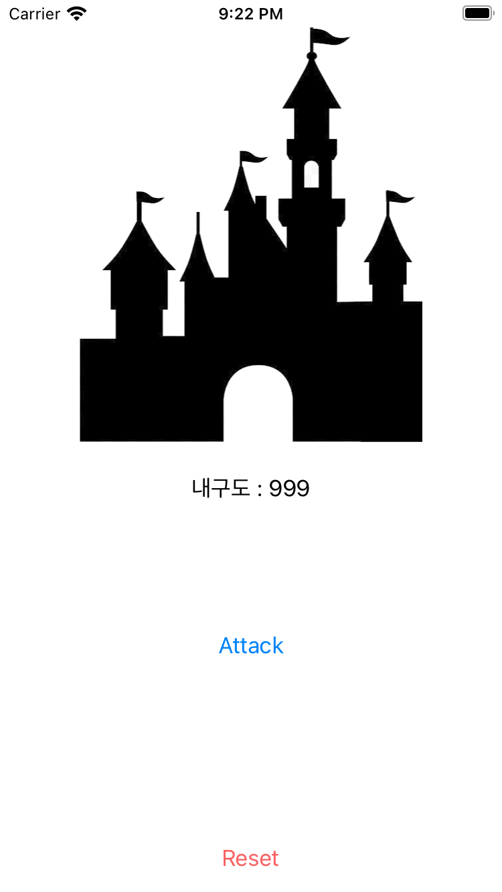

# User Defaults

User Defaults는 앱 내에서 데이터를 반영구적으로 저장하는 방법으로 앱이 꺼졌다 켜져도 해당 데이터를 유지하고 가지고 있다.

구체적으로는 내부에 plist 파일을 생성하여 이에 키-값 쌍으로 저장하고 파일이 켜질 때 불러온다. 그렇다고 모든 데이터를 User Defaults를 통해 저장을 하지는 않고 간단한 설정값, 환경값 등을 저장한다. 혹은 매우 적은 수준의 데이터

## 사용하기



Attack 버튼을 누르면 성의 내구도가 1씩 감소하며

Reset 버튼을 누르면 성의 내구도가 초기화 된다.

내구도는 어플리케이션이 종료되어도 유지된다.

```swift
import UIKit

class ViewController: UIViewController {

  @IBOutlet var castleHitPointLable: UILabel!
  var castleHitPoint = -1 {
    didSet {
      castleHitPointLable.text = "내구도 : \(castleHitPoint)"
      UserDefaults.standard.set(castleHitPoint, forKey: "CastleHitPoint")
    }
  }
  
  override func viewDidLoad() {
    super.viewDidLoad()
    
    castleHitPoint = UserDefaults.standard.integer(forKey: "CastleHitPoint")
    castleHitPoint = castleHitPoint == 0 ? 999 : castleHitPoint
  }
  
  @IBAction func attackButton() {
    castleHitPoint -= 1
  }
  
  @IBAction func resetButton() {
    castleHitPoint = 999
  }
}
```

먼저 castleHitPoint 프로퍼티의 didSet을 보면

```swift
UserDefaults.standard.set(castleHitPoint, forKey: "CastleHitPoint")
```

CastleHitPoint 라는 키값에 castleHitPoint 값을 저장하고 있다.

이를 UserDefaults.standard.set 명렁어를 통해 접근 할 수 있다.

viewDidLoad에서는 

```swift
castleHitPoint = UserDefaults.standard.integer(forKey: "CastleHitPoint")
```

뷰가 로드되면 "CastleHitPoint'라는 키로 저장된 정수값을 가져온다. 이를 통해 저장된 값을 가져올 수 있다.

만약에 없는 존재하지 않는 키값에 접근하면 어떻게 반응할까?

```swift
brokenCastleCnt = UserDefaults.standard.integer(forKey: "BrokenCastleCount")
    print(brokenCastleCnt)
```

viewDidload 내에 위 처럼 작성하고 값을 출력시켜 보면 무조건 0이 출력됨을 알 수 있다. 값이 없는데 nil이 아니라 0이 출력되는게 조금 불편한 부분이다.

value 메소드를 통해 옵셔널로 가져올 수도 있다.

```swift
if let value = UserDefaults.standard.value(forKey: "BrokenCastleCount") as? Int {
      print(value)
    } else {
      print("BrokenCastleCount key is invalid")
    }
```

## 저장되는 위치

iOS앱은 샌드박스라고 하는 보호된 환경에 있다. 각 앱에는 파일을 저장하기 위한 자체 폴더가 존재하고 다른 앱에 속한 디렉터리나 파일에는 액세스가 불가능하다.

이를 통해 바이러스와 같은 악성 소프트웨어로 인한 앱에 데미지를 입히지 않도록 방지한다.

앱은 앱의 샌드박스에 있는 'Documents' 폴더에 파일을 저장한다. 이 'Documents'폴더는 iCloud와 동기화 할때 백업할 수 있다. 또한 앱이 새 버전으로 업데이트 되어서 그대로 유지되기 때문에 이는 굉장히 유용하다.

```swift
print(FileManager.default.urls(for: .documentDirectory, in: .userDomainMask)[0])
```

위 코드를 viewDidLoad에 입력해보자

뷰가 로드되면 디버그콘솔에 해당 url이 출력된다.

```swift
file:///Users/hoseunglee/Library/Developer/CoreSimulator/Devices/BCC9DE1E-B271-46C7-9200-7128F4646D4D/data/Containers/Data/Application/49DEC57E-EF99-432E-9D39-6EEDA2C14D79/Documents/
```

위 주소는 시뮬레이터 상의 주소이긴 하지만 실제 앱이 빌드되어도 위와같이 주소가 생성된다.

UserDefaults는 Documents 디렉토리가 아닌 Library/Preferences 에 저장된다!

UserDefaults는 addSuite(named:) 메소드를 통해 써드파티 앱 컨테이너에 접근이 가능하긴 하다!

[https://developer.apple.com/documentation/foundation/userdefaults/1410294-addsuite](https://developer.apple.com/documentation/foundation/userdefaults/1410294-addsuite)

## 사용자 정의 타입 저장하기

UserDefault는 기본적으로는 Swift의 기본 자료형만 저장이 가능하다.

하지만 plist 파일로 저장된 데이터의 구조는 키값 쌍의 구조로 JSON과 동일하다 그렇기 때문에 data 타입으로 저장 후 Encoder, Decoder를 통해 Plist 데이터를 읽고 쓸 수 있다.

```swift
import UIKit

class Castle: Codable {
  var hitPoint: Int {
    didSet {
      if hitPoint == 0 {
        brokenCount += 1
        hitPoint = 10 * brokenCount
      }
    }
  }
  var brokenCount: Int
  
  init(hitPoint: Int, brokenCount: Int) {
    self.hitPoint = hitPoint
    self.brokenCount = brokenCount
  }

}

class ViewController: UIViewController {

  @IBOutlet var castleHitPointLable: UILabel!
  @IBOutlet var brokenCastleCnt: UILabel!
  
 
  var castle = Castle(hitPoint: 10, brokenCount: 0)
  
  
  override func viewDidLoad() {
    super.viewDidLoad()
    
    
    
    loadData()
    updateLable()
  }
  
  @IBAction func attackButton() {
    castle.hitPoint -= 1
    updateLable()
  }
  
  @IBAction func resetButton() {
    castle.hitPoint = 10
    updateLable()
  }
  
  func updateLable() {
    castleHitPointLable.text = "내구도 : \(castle.hitPoint)"
    brokenCastleCnt.text = "부서진 회수 : \(castle.brokenCount)번"
    saveData()
  }
  
  func saveData() {
    do {
      let castleData = try JSONEncoder().encode(castle)
      UserDefaults.standard.set(castleData, forKey: "Castle")
    } catch {
      print(error.localizedDescription)
    }
  }
  
  func loadData() {
    do {
      if let data = UserDefaults.standard.data(forKey: "Castle") {
        let decoded = try JSONDecoder().decode(Castle.self, from: data)
        castle = decoded
      }
    } catch {
      print(error.localizedDescription)
    }
  }
}
```


Castle 클래스를 만들고 이를 Codable 프로토콜을 채용한 뒤 JSON Encoder, Decoder를 통해 Data로 만든다. UserDefaults는 Data 타입의 쓰기와 읽기를 허용하므로 사용자 정의 클래스를 UserDefaults를 통해 저장이 가능하다!